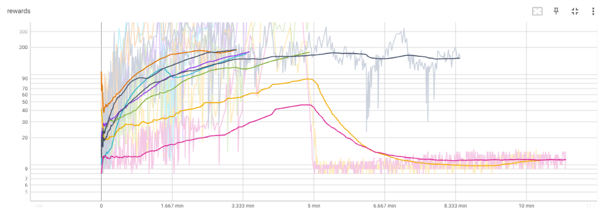

# 194.077-Applied-Deep-Learning

Implementation and performance of policy-based n-step A2C agent for openAI-gym environment

Video Project Presentation: https://www.youtube.com/watch?v=bbEv1J6oSts

---

## GOALS

Get details

### The project outcome shall definitely include:

1. Implementation of an n-step A2C-agent for discrete action spaces

   - Employment of the agent on an open-ai gym environment to establish baseline
   - Seek improvement by adaption of NN and agent configuration

2. Implementation of an n-step A2C- agent for continuous action spaces
   - Employment of the agent in a PyBullet (physics-based) environment
   - Comparison of performance between discrete-A2C and continuous-A2C in similar environment

3. A little [compendix](#foundations) about policy-based methods 

### I will treat the following as BONUS (if time allows [it did not]):

3. Implementation of a DQ- agent for at least one of the action-space scenarios described above
4. Comparison of convergence and policy quality between action-value-based agent and policy-based agent

### _Personal goals:_

1. Broaden understanding of different approaches to reinforcement learning there are
   and how they relate to another by learning about and implementing a üpolicy-based method
2. Dealing with continuous action / state spaces

### _Note: The agents above will be restricted to "ending problems" (= such ones that feature episodes)_

---

## STEPS& MILESTONES

Steps that correspond to BONUS-quests are marked with [BONUS].

Get details

### 1. Solidify understanding about policy-based methods

_planned:_ 10h _actual:_ ~15h

While I have some experience with Q-learning and DQ-learning agents, I have not implemented algorithms from the policy-based family.

- **How:** read relevant chapters in Sutton& Barto (2nd edition)[^1], follow relevant lecture material (Deep Mind - Lecture Series) [^2]
- **Result:** I composed a little introduction to policy-based methods to document the underlying theory [here](#foundations)

### 2. Set error-metric

_planned:_ 5h _actual:_ 2h

- **Policy success:** For gym- environments this metric is defined in literature (f.e. CartPole-v1: $reward>=200$ per episode)
- **Convergence:** $loss_{total} = loss_{actor} + loss_{critic} + loss_{entropy}$. I measure the total loss per batch (a constant number of steps) and while i refrain from setting a numberic goal here, the metrics behavior over time should clearly indicate whether the agent reached a stable state

### 3. Decide for an environment

_planned:_ 8h _actual:_ 8h

At the start I wanted to work with an TrackMania Nations [^5] framework. Due to exptected extensive GPU training time (5h), I downgraded to PyBullet's implementation of RacecarBullet [^7] only to realize that documentation is barely comprehensive and some methods necessary to wrap it into a gym-env were not provided, which in turn led me to be content with the classical CartPoleEnv.

I overestimated the importance of this step in the beginning, because I had not yet understood the requirements that would allow an environment to be used as an experimental basis:

- simple: we don't want to train for hours every time we implement a tiny change
- well documented
- visualizable
- available in both continuous and discrete action-space version

For the start it does not matter much how fascinating an environment might be, the methods are the same no matter how large the state- and action-spaces.
In order to proof functionality we will have to start on simple tasks anyways.

### 4. Hacking time I - discrete action-space A2C agent

_planned:_ 15h _actual:_ ~22h (10h + 3h + 4h + 4h)

- Implement the A2C- agent for discrete action spaces.
- Set up training-data-visualisation (Tensorboard) and policy-saving infrastructure.
- Read about posssible improvements and implement them
- Bring all of the above into neat, representable shape

### 5. Hacking time II - continuous action-space A2C agent

_planned:_ 12h _actual:_ 28h [and at current point still learning progress is still unstable]

Making this work appears to demand way more than just adapting NN-output, call and loss functions.

For details on how this proceded, move to the [Results](#results) section.

### 7. [BONUS] Hacking time III

_planned:_ 12h _actual:_ /

- Implement DQ- agent.
- form hypothesis on behaviour compared to policy-based method

### 6. Policy performance and convergence analysis/ [BONUS] comparative study

_planned:_ 10h _actual:_ 10h

- Train and document agent performance and convergence for different versions
- Implement test function that will run best agent
- Verify results by visualisation of the policy
- Bring results into form for delivery

### 8. Presentation

_planned:_ 4h _actual:_ 

Prepare for presentation.

### 9. Application/ Visualisation

_planned:_ 6h _actual:_ /

- this is sort of included in the 'REPORT___.ipynb' files

---

#### Sum of steps: _planned_ ~80h _actual_ ~85h (excluding presentation)

---

## FOUNDATIONS

Get details

### General overview:

1. Model-based (focus on transition function between states, tough to go from model to actual policy)
2. Value-based (learn action-value function, easy to derive policy from the a-v-function, but the value function might be very complex, even if policy is super simple ==> sometimes not efficient in learning)
3. Policy-based (we don't learn the value, but simply the policy that optimizes the value)

1 and 2 don't focus on the real objective: policy

### Policy-Based:

#### Method Derivation:

1. Parametrize policy directly: $pi_{theta}(a|s)=p(a|s,theta)$
   sigma: NN-weights

2. What do we learn exactly?
   2.1) We define performance $J1(sigma)=v_{pi_{theta}}(s)$ for the starting state 1. We might want this performance measure to be maximized.
   2.2) Or the want the weighted average performance of the state-space to be maximized: $J_{average}(theta)= integral_{over_{mü}}*v_{pi_{theta}}(s)$ with mü being the partition of time we spent in a certain state when following our policy. ==> a natural approach, since we want to do well in the states that appear often

3. Now that we have set the objective, we need to optimize the policy in a way to fulfill our demand. Gradient accent is useful (since we want to find a maximum): $delta(theta)=gradient_{theta}(J(theta))$

4. How to estimate the gradient? It might sound natural to sample from the policy, obtain a reward R and derive R with respect to all $theta_i$. However, that's not possible since R is a numeric value. Instead we use mathematical identity that allows to build the gradient over the expected reward instead of the the expected gradient of the reward (see Sutton&Barto page 325). This is called "score function trick"

5. We want to make 4) useful for sequential rewards and get rid of the sum. Turns out that we can adapt the update-formula in a way that rids of of the quality function and only uses the reward instead. (p.327) The Gradient theorem states now that we can replace the reward with the value function v.

6. We now introduce baselines in order to reduce variance in the update: Let's introduce the baseline function $b(s)=V(s)$ (which doesn't depend on the action).We define b to be the Monte Carlo return (=average reward over whole episode). The advantage is defined as $Q(s,a)-V(s)=R_{t+1}+gamma*V_{s+1}-V_{s}$. The latter can be estimated by TD learning (=critic)

#### Actor-Critic[^3] _on policy_

Actor: learns policy; updates $theta$

Critic: learns value; updates $w$

"Advantage"-A2C: state $s$ has a value $V(s)$ and state-action $a|s$ has a value $Q(a|s)$. If we subtract $A=Q-V$, we obtain the the advantage $A$ of taking action $a$

Learning the two functions ( $A(s)$ and $pi(s)$ ) is usually done simultaneously, but it might be useful to first learn value-function well, before starting to learn to policy.

_Notes:_

- if we let multiple agents explore multiple instances of the same environment and let dem update the shared policy asynchronously training time can be decreased and effects in a single agent can be averaged out. This is called A3C.
- We need on policy targets (from that exact same step), off policy will introduce bias
- Dataset needs to be GOOD, because a single timestep with bad policy can destroy the process ever after (Trust region policy ==> $pi_{t+1}$ not very different from $pi_t$)
- Gaussian Policies

### Usefulness (in comparison to action-value-based methods)

_Downsides_

- Tougher to get off the ground
- Policy does not capture any information about the environment ==> so as soon as environment changes, policy might be useless
- As a result: inefficient use of samples (datapoint might not be very useful to the policy, but it might teach a lot about the world) ==> to use this more advanced policy-based-agents also learn value function parallel to policy (A2C does this, PPO does not)

_Advantages_

- Policy might turn out to be very simple
- Agent can naturally handle continuous action spaces
- Agent can learn stochastic policies ==> There are simply grid world situations where deterministic policies cannot distinguish seemingly equal states and the agent will end up in a deadlock. Random movement in such an undistinguishable state might be better here. Second example: Pokergame (we might want to include stochastic actions in order to decrease predictability)
- Agent can learn appropriate levels of exploration (probability for randomness can be different in every state, which isn't possible in value-based policies)

---

## ARCHTECTURE AND IMPLEMENTATION

Get details

### Elements we need for an n-step A2C:

1. State representation: $S_t$. Does not only have to be the current observation, but maybe also the prior state (=recurrent network?) $(S_{t-1},O_t)->S_t$

2. 2NNs: value- and a policy network (critic(w) and actor(theta)) $S -> v$, $S -> pi$

3. Loss functions (for 1-step A2C):

   3.1) Critic: We want $TD=R_{t}+gamma*V_{s+1}-V_{s}=A(s,a)$ to be minimal, which is why we define the loss function as $MSE(A)=A(s,a)^2$

   3.2) Actor: (min 1:16 [^2]) We have to generate a "semi-gradient"=loss from our defined gradient (since Tensorflow optimizers demand one). We do this by multiplying the advantage with the likelihood of taking the action taken: $A(s,a_t)*log_{prob}(a_t|s_t)$. This makes sense intuitevely, if the agent decided on an unlikely action (under current policy) but obtained a large advantage from doing so, the loss will be high (we want the policy to be changed towards: High-advantage-yielding actions shall correspond to high probabilities)

4. Loss functions (for n-step A2C):

   4.1) Critic: $R_{t}+R_{t+1}*gamma+..+R_{t+n-1}*gamma^{n-1}+gamma^{n}*V_{s+n}-V_{s}$

   4.2) Actor: $\sum{log_{prob}(a_t|s_t)}*A(s,a_t)$ for $t=t,..,t+n$

!NOTE!: In order to enable more efficient training and computations we will use only one NN. Only the last network layer(s) will be different in order to faciliate distinct propability or value output (branches). But what does this mean for the loss functions? We simply sum them up: $loss_{total} = loss_{actor}+loss_{critic}$

Note: If we want to penalise large differences between $P(a_{chosen}|s)-P(a_i|s)$, we add a term for the entropy-loss (this should increase stability)

### Algorithm

#### for ending problems (such as the PoleCart, which terminates once the stick is inclined too far to one side)

1.  initialize $s_0$
2.  initialize trace vectors (storage units for store $r_t,..,r_{t+n}$ and $V_t,..,V_{t+n}$
3.  Loop while $s_t$ is not terminal
4.  compute action propabilities $probs_a=pi(.|s)$
5.  choose action $a_t$ by randomly sampling from distribution
6.  take action $a_t$, observe $r,s_{t+1}$
7.  append $r_t$ $V_t$ to trace vectors
8.  if len(trace vectors)== batch.size: perform weight update in NN; clear trace vectors
9.  $s_t=s_{t+1}$

#### adapting for continuing problems (such as the BulletHopper)

"for continuing problems without episode boundaries we need
to define performance in terms of the average rate of reward per time step" [^1]

Why and what exactly does that mean? Let's answer this during another session..

---

## CLASSES AND FILES

Get details

0. REPORTS

    - **REPORT______.ipynb**

      * showcase for discrete and continuous action-spaces
      * hold convergence analysis for different agent configurations

1. AGENTS AND TRAINING

    - **a2cgent______.py**

      * holds _Agent()_ class
      * with methodes to define NN architecture
      * and it's related functions (call, value/action)
      * loss functions

    - **train______.py**

      * holds _Session()_ class ([NOTE: not true for continuous_shared_NN])
      * initiates environment
      * holds train() and test() methods
      * point of interaction for user to set options for _Agent()_-object initialization
      * policy-saving and -loading

2. UTILS

    - **continuous-cartpole-env.py**

      * holds a custom CartPole environment with continuous action-space forked from [here](https://gist.github.com/iandanforth/e3ffb67cf3623153e968f2afdfb01dc8) and adapted
      such that the render() method integrates with the newest gym= 0.23

    - **training______/** 

      * hold (pretrained) models
      * store training data (rewards, losses) for TensorBoard visualisation

    - **obs-samples/** and **theory/**

      * holds sample-space data for 'CartPole-problem' that can be used for state normalization
      * holds some links to related articles and work I find useful

---

## RESULTS

Get details

### Discrete-action-space A2C agent

- Base model did not meet gym's 'problem solved' criteria
- **Improved agent (featuring state normalization and mish-activation) solved it in *21120  steps***
- please follow and run **'REPORT_discrete.ipynb'** for more details and consider it an interactive report for the discrete case

### Continuous-action-space A2C agent

- More troublesome than discrete case; unstable training
- **No agent solved the open-ai gym problem reproducably**

#### ..with shared NN

- Some lucky runs deliver results, the overall architecture seems to be sound 
  * In such cases: good learning within the first 100 episodes, just to collapse after
  * Those 'lucky' models have been stored (see notebook)

- The following improvements were tried:
  * state normalization
  * batch normalization
  * reward customization: introduction of penalties for terminal states
  * network architecture: addtional layers, number of nodes/layer
  * **learning rate**
  * loss weights
  * introduce gradient clipping in Adam-optimizer
  * utilization of custom implementations of the same environment
  * pretraining of critic-NN

- None with great success
- Watch the unstable shared-NN agent at **'REPORT_continuous_shared_NN.ipynb'**

- **POTENTIAL ROOT OF ERROR:** Experimenting with 'Acrobat-v0()' (larger action-space than 'CartPole-v1()') in the discrete-action-agent case showed similar behaviour on some occasions. I believe that with increasing complexity of the policy-options (action-space) decoupeling of actor and critic becomes more important. Yet, I did not suspect this when I started out and my architecture uses one NN with two branches, which makes it impossible to set different learning rates for the update.
However, articles such as [this](https://www.reddit.com/r/reinforcementlearning/comments/jqgrtg/sharing_network_for_actor_critic_methods/) suggest that this might impact learning success majorly.

#### ..with distinct NN

- So I implemented a new actor-critic with 2 NN, this led..
  * to way better NN convergence, because as suggested in several articles the learning rate of the critic is now way higher than the actor one (actor can only make good decisions once critic estimates values well)
  * but while the agent converges, it still does not consistently converge towards 'high-reward' policies
  * those few configurations that deliver (at least short term) sound learning are reproducable

- Watch the distinct-NN agent at **'REPORT_continuous_distinct_NN.ipynb'**

### NOTE: 
#### *'REPORT_...ipynb'* files are essentially the heart of the report and to be browsed in the order they were introduced in this section. They also provide a way to visualize all learning relevant performance analysis conducted via TensorBoard

---

## RESEARCH, REFERENCES AND LIBRARIES

[^1:] [Sutton&Barto - Reinforcement Learning](https://inst.eecs.berkeley.edu/~cs188/sp20/assets/files/SuttonBartoIPRLBook2ndEd.pdf)

[^2:] [Deep Mind - Lecture Series](https://www.youtube.com/watch?v=bRfUxQs6xIM)

[^3:] [Asynchronous Methods for Deep Reinforcement Learning](https://paperswithcode.com/paper/asynchronous-methods-for-deep-reinforcement)

[^4:] [Playing Atari with Deep Reinforcement Learning](https://paperswithcode.com/paper/playing-atari-with-deep-reinforcement)

[^5:] [Track Mania Nations Reinforcement Framework](https://github.com/trackmania-rl/tmrl)

[^6:] [Continuous-action Reinforcement Learning for
Playing Racing Games: Comparing SPG to PPO](https://arxiv.org/pdf/2001.05270v1.pdf)

[^7:] [PyBullet docu](https://docs.google.com/document/d/10sXEhzFRSnvFcl3XxNGhnD4N2SedqwdAvK3dsihxVUA/edit#heading=h.2ye70wns7io3)
